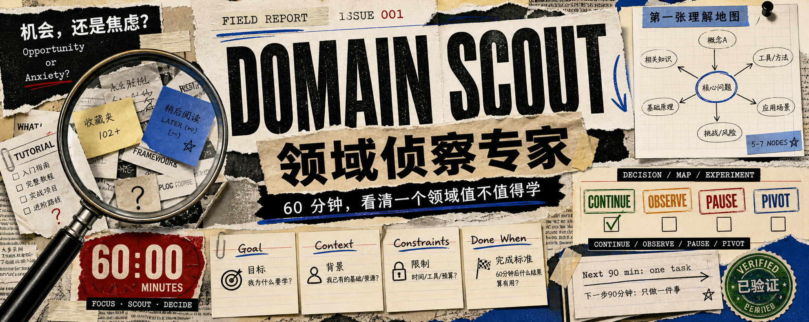

<h1 align="center">DOMAIN-SCOUT-SKILL</h1>

<p align="center">
  一个用于“60 分钟判断一个领域值不值得学”的领域侦察专家 Skill。
</p>
<p align="center">
你是否想学习一个领域，却不确定它是否值得投入？你是否看了很多资料，仍拼不出一张清晰的底图？你是否希望在真正开始前，先看懂它的机会、门槛和第一条学习路径？
</p>
<p align="center">
  
  
  
  
  
  
</p>

> ✅ Verified: 已通过本地校验脚本和 Codex Skill 校验；可生成“继续学 / 观察一下 / 暂缓投入 / 换方向”的判断、第一张理解地图和下一步 90 分钟任务。



---

很多人不是不愿意学习，而是不知道自己到底该不该学。

看到一个新领域，先收藏教程；看到别人说有前景，开始焦虑；打开第一篇资料，又被概念、工具、路线图和案例淹没。结果是：还没真正开始，就已经消耗掉了判断力。

这个 Skill 解决的不是“把一个领域完整教会你”，而是更前置的问题：

**你想学的这个领域，到底是机会，还是焦虑？**

它会把一次模糊的学习冲动，压缩成一个 60 分钟的侦察流程：先确认目标，再画出 5-7 个核心节点的第一张理解地图，然后通过一个小实验或低压力练习暴露真实卡点，最后给出是否继续投入的判断。

## What It Does

- 判断一个领域、新知识点或学习方向是否值得继续学
- 生成 5-7 个节点的第一张理解地图
- 设计一个 20 分钟小实验，或三个低压力练习
- 标注“已懂 / 还在混 / 待核验 / 未验证”
- 给出下一次 90 分钟只做一件事的学习任务

## When To Use

适合这些场景：

- 想学一个新领域，但不知道是否值得投入
- 看了很多资料，仍然拼不出第一张底图
- 想快速判断一个新技术、新赛道、新知识点是否和自己有关
- 想创建“领域侦察专家”这类学习判断型智能体

不适合这些场景：

- 直接要完整课程或长期学习计划
- 只需要一个概念定义
- 已经明确要做具体工程实现、修 bug 或部署项目
- 需要法律、医疗、金融、投资等高风险定论

## Repository Structure

```text
domain-scout/
├── SKILL.md
├── scripts/
├── references/
│   └── output-example.md
└── assets/
```

核心规则在 [domain-scout/SKILL.md](domain-scout/SKILL.md)。

完整输入到输出示例在 [domain-scout/references/output-example.md](domain-scout/references/output-example.md)。

## Expected Output

一次完整调用应该收敛到这几个交付物：

```text
结论：继续学 / 观察一下 / 暂缓投入 / 换方向
理解地图：5-7 个核心节点
验证动作：1 个小实验或 3 个低压力练习
下一步：90 分钟只做一件事
核验项：需要查官方或权威来源的信息
```

## Validate

Run the local validator:

```powershell
python tools/validate_skill.py domain-scout
```

Expected result:

```text
Skill is valid: domain-scout
```

Codex Skill validator:

```powershell
$env:PYTHONUTF8='1'
python C:\Users\lucianaib\.codex\skills\.system\skill-creator\scripts\quick_validate.py D:\Project\Skill\domain-scout
```

Expected result:

```text
Skill is valid!
```

## Expert Page Copy

名称：领域侦察专家

副标题：你想学的这个领域，到底是机会，还是焦虑？60 分钟，看清它值不值得、你适不适合、第一张理解地图在哪里。

## License

This project is open-sourced under the [MIT License](LICENSE).

---

## 作者

**LucianaiB**：专注 AI 应用落地与 AI App 设计开发的开发者，代表作品有 DocPilot Qwen、LifeTrace、GeoMind 等。更多项目与联系方式见个人主页 <https://lucianaib.is-a.dev>。
